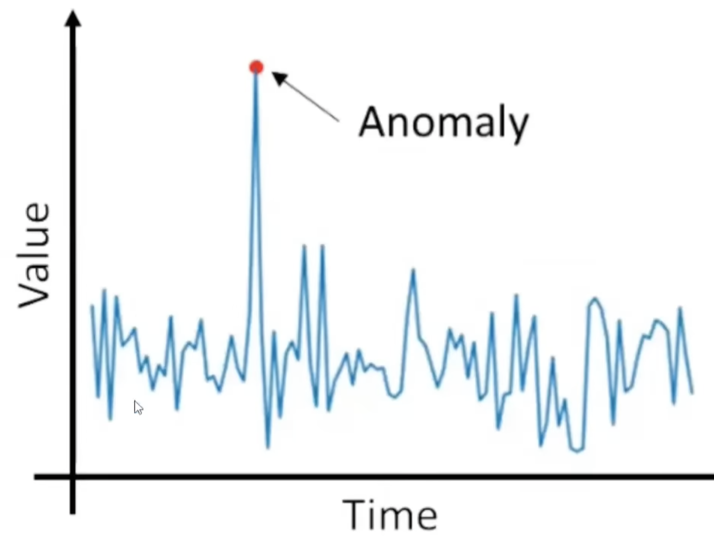
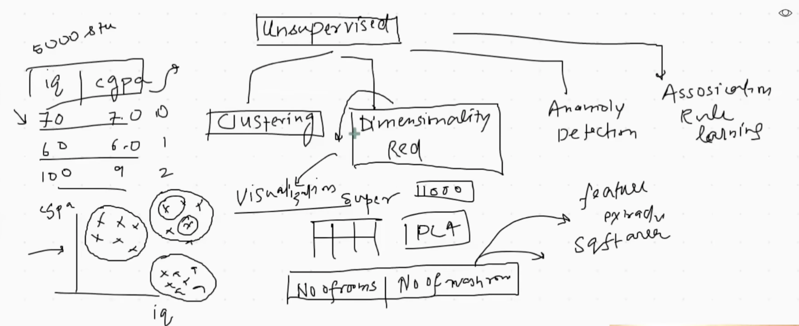

Machine Learning algorithms are typically categorized based on the amount of external supervision needed for the algorithm to get trained.
Based on this criteria, the sources identify four main types of Machine Learning:
1. Supervised Machine Learning
2. Unsupervised Machine Learning
3. Semi-Supervised Machine Learning
4. Reinforcement Learning

# 1. Supervised Machine Learning
In Supervised Machine Learning, the dataset includes both input and the corresponding output data. The goal is for the algorithm to determine the relationship between the input and the output so that it can predict the output for new input data.
Supervised Machine Learning is further divided into two sub-categories based on the type of output data (the target column):
###  1)  Regression: 
This is used if the output column is numerical (e.g., predicting house prices, salary, or CGPA).
### 2)  Classification: 
This is used if the output column is categorical (e.g., determining if a student got placement (yes/no), classifying an email as spam or not, or identifying if an image contains a dog).
# 2. Unsupervised Machine Learning
In Unsupervised Machine Learning, the system is provided with input data only, and there is no output column. Since there is no output, the task is not prediction; instead, the goal is to perform other types of analysis.
Unsupervised Machine Learning is typically divided into four categories:
### 1) Clustering: 
This technique groups data points into distinct categories or clusters. For example, clustering can divide students or e-commerce customers into different behavioral groups, helping to identify the customer types.
### 2) Dimensionality Reduction: 
This technique is used when a dataset has too many input columns, which can cause algorithms to run slowly or fail to improve results. Dimensionality Reduction removes those extra columns or combines multiple related columns into a single column, thus reducing the number of dimensions. It is also valuable for visualization, as it can reduce high-dimensional data (like 784 dimensions in image data) down to two or three dimensions so that the relationships can be plotted and studied.
### 3) Anomaly Detection: 
This involves identifying unusual or unexpected data points that deviate significantly from the norm (e.g., detecting defects in manufacturing or fraud in credit card processing).

### 4) Association Rule Learning: 
This technique mines information from the data to determine relationships or patterns. For example, in retail, it can be used to determine that two seemingly unrelated products (like baby diapers and beer) are often purchased together, which helps in organizing products in a store.
# 3. Semi-Supervised Machine Learning
Semi-Supervised Machine Learning is described as being partially unsupervised and partially supervised. It is used when labeling the entire dataset (creating output columns) is a difficult or expensive process that requires human effort.
The technique involves labeling only a small portion of the data (one or two data points), and the system uses that information to automatically label the rest of the points. An example of this is how Google Photos automatically clusters faces in images and then, once the user labels one instance of a person, the system labels all other instances of that person.
# 4. Reinforcement Learning
Reinforcement Learning operates fundamentally differently, as the system is given no initial data. The algorithm, called an Agent, starts from scratch (tabula rasa) and gradually improves by interacting with its Environment.

The agent makes an action and then receives a Reward (for a positive outcome) or a Punishment (a negative reward).
The agent uses these rewards and punishments to update its Policy (its rule book for what action to take next).

The goal of the agent is to keep repeating this process to maximize its total reward and minimize punishment while operating within its environment. This process is likened to training a dog or how humans learn through errors. Reinforcement Learning has been famously used to create an agent that defeated a human champion in the complex game of Go

