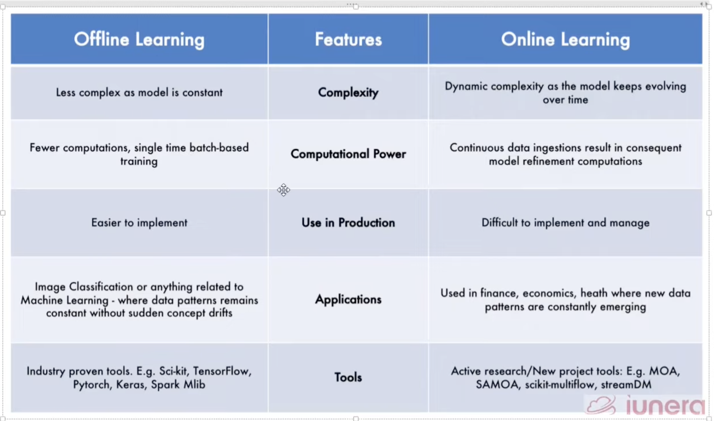

in this types of learning  the model is trained continuously as new data arrives. This allows the model to adapt to changes in the data over time. Online learning is particularly useful in scenarios where data is generated in a stream or when the dataset is too large to fit into memory all at once. chatbot are the examples of online learning.

