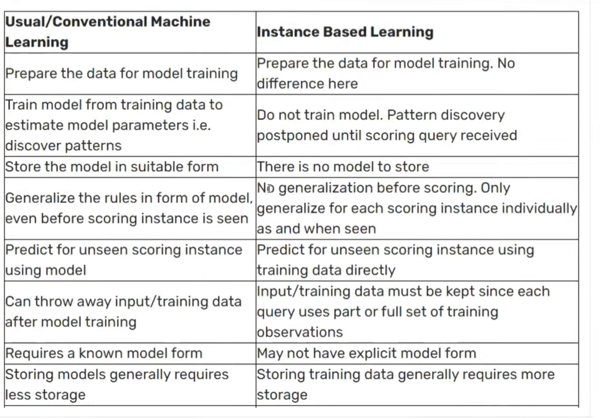

### Instance Based Vs Model Based Learning
Machine Learning algorithms can also be categorized based on how they learn from data. Two primary categories in this regard are Instance-Based Learning and Model-Based Learning.

#### Instance-Based Learning
Instance-Based Learning algorithms, also known as lazy learning algorithms, do not create a general model of the data during the training phase. Instead, they store the training instances and use them directly to make predictions for new data points. When a new instance is presented, the algorithm compares it to the stored instances and makes predictions based on the most similar ones.

exmples of Instance-Based Learning algorithms include:
- k-Nearest Neighbors (k-NN)
- Case-Based Reasoning
- Locally Weighted Regression

#### Model-Based Learning

Model-Based Learning algorithms, also known as eager learning algorithms, create a general model of the data during the training phase. They analyze the training data to identify patterns and relationships, which are then used to make predictions for new data points. Once the model is trained, it can make predictions without needing to refer back to the original training instances.

Examples of Model-Based Learning algorithms include:
- Linear Regression
- Decision Trees
- Neural Networks
#### Key Differences

