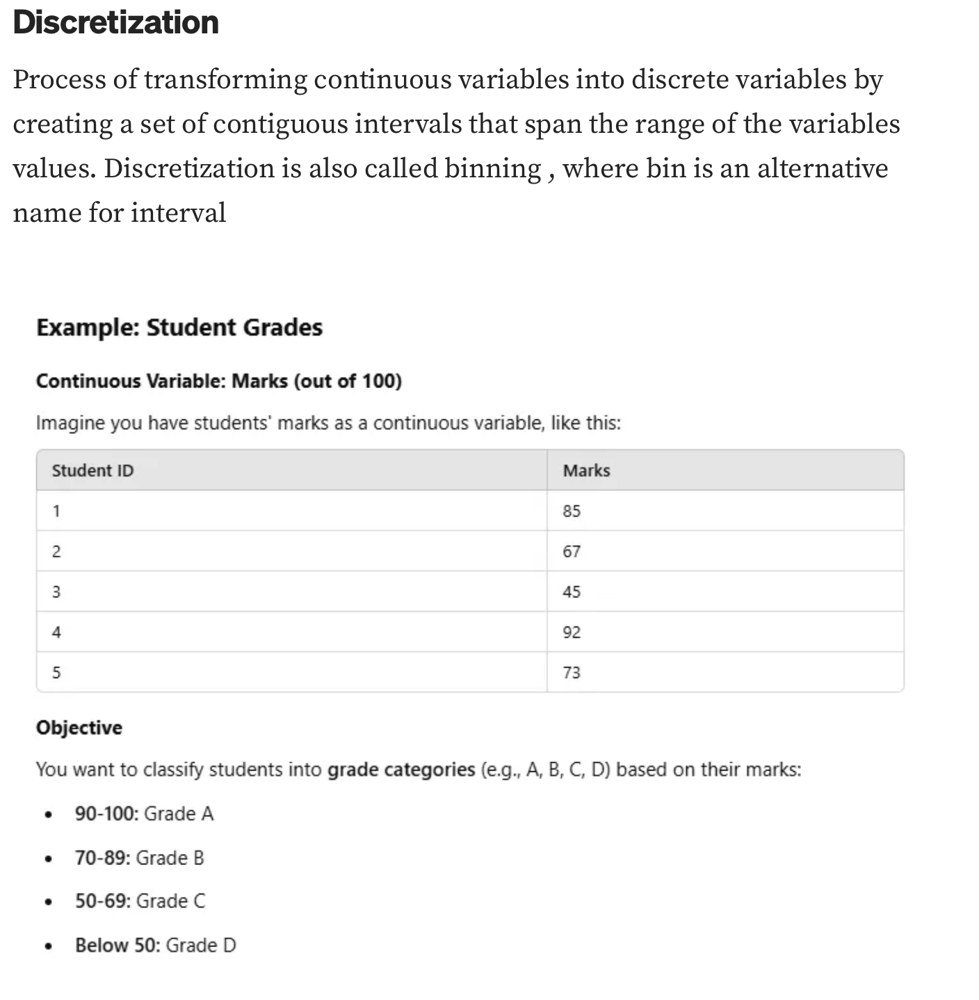
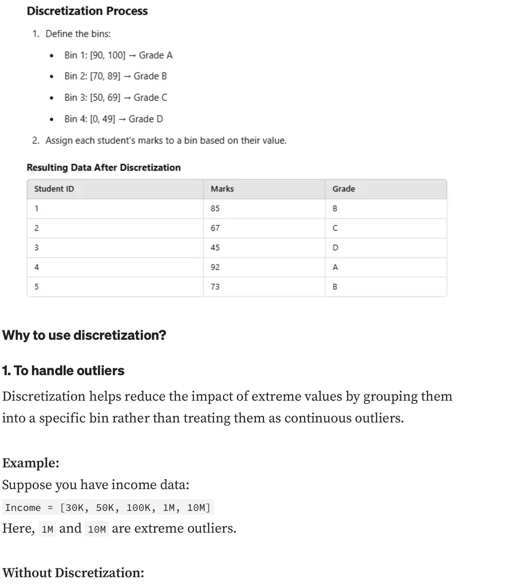

# what is  Binning and Binarization in Machine Learning?
Binning and Binarization are two important preprocessing techniques used in machine learning to transform continuous data into discrete formats.
## Binning
 

Common methods of binning include:

1. **Equal-width binning**: Divides the range of the variable into intervals of equal size.
2. **Equal-frequency binning**: Divides the data such that each bin contains approximately the same number of data points.
3. **Custom binning**: Allows the user to define specific bin edges based on domain knowledge or specific requirements.
Binning is particularly useful for algorithms that require categorical input or when the relationship between the variable and the target is non-linear.
## Binarization
Binarization is the process of converting continuous or categorical variables into binary format (0s and 1s). This technique is often used when a feature needs to be represented as a binary indicator, such as in classification tasks. Binarization can be achieved through various methods, including:
1. **Thresholding**: Setting a threshold value, where values above the threshold are assigned a 1 and those below are assigned a 0.
2. **One-hot encoding**: Converting categorical variables into binary vectors, where each category is represented by a separate binary feature.
Binarization is particularly useful for algorithms that require binary input or when the presence or absence of a feature is more important than its magnitude.
Both binning and binarization can enhance the performance of machine learning models by simplifying the data and making it more interpretable. However, it's important to choose the appropriate method based on the specific characteristics of the dataset and the requirements of the machine learning algorithm being used.

    