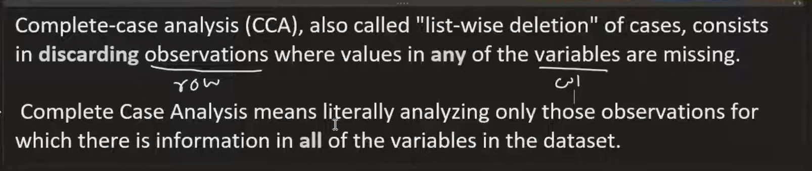

### what is CCA (Complete Case Analysis)?
Complete Case Analysis (CCA) is a method used to handle missing data in a dataset by excluding any records (rows) that contain missing values. This approach is straightforward and easy to implement, as it simply involves removing incomplete cases from the analysis. However, it can lead to biased results if the missing data is not random, as it may disproportionately exclude certain groups or patterns within the data. CCA is most appropriate when the amount of missing data is small and when the missingness is completely at random (MCAR).

 

### When to Use CCA?
- When the proportion of missing data is small, and removing incomplete cases will not significantly reduce the sample size.
- When the missing data is believed to be completely at random (MCAR), meaning that the likelihood of a value being missing is unrelated to any other variables in the dataset.

### Limitations of CCA
- Loss of Data: CCA can lead to a significant reduction in sample size, which may affect the statistical power of the analysis.
- Bias: If the missing data is not random, CCA can introduce bias into the results, as certain patterns or groups may be underrepresented.
- Not Suitable for All Datasets: CCA may not be appropriate for datasets with a high proportion of missing data or when the missingness is related to other variables in the dataset.

### Alternatives to CCA
- Imputation Methods: Techniques such as mean/median imputation, KNN imputation, or multivariate imputation can be used to estimate and fill in missing values.
- Model-Based Approaches: Using models that can handle missing data directly, such as certain machine learning algorithms that can work with incomplete datasets.
- Multiple Imputation: A statistical technique that involves creating multiple complete datasets by imputing missing values and then combining the results for analysis.
