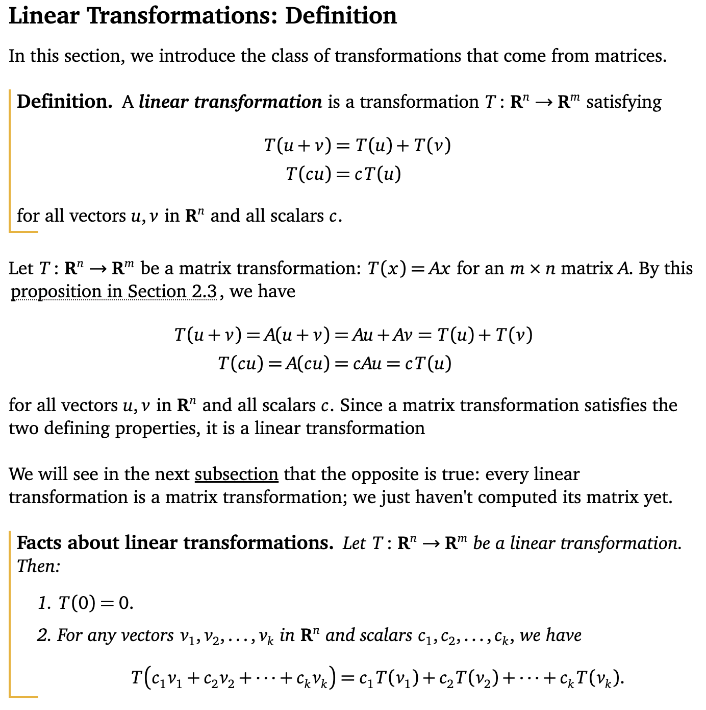
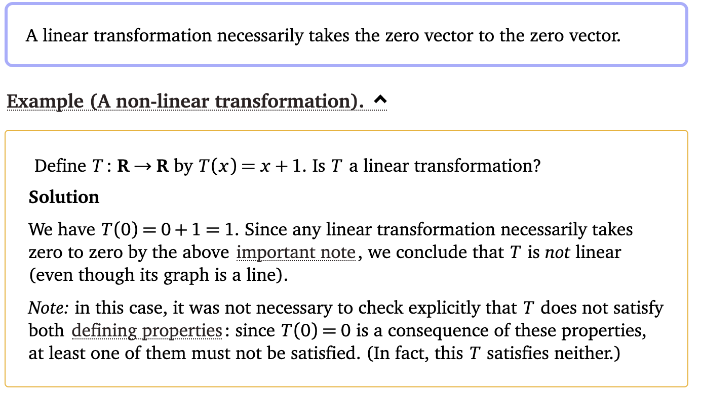
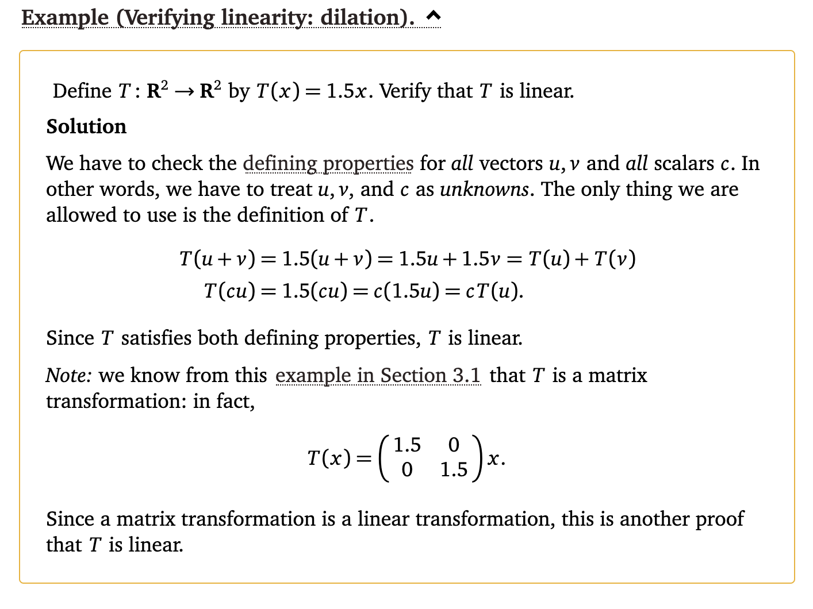
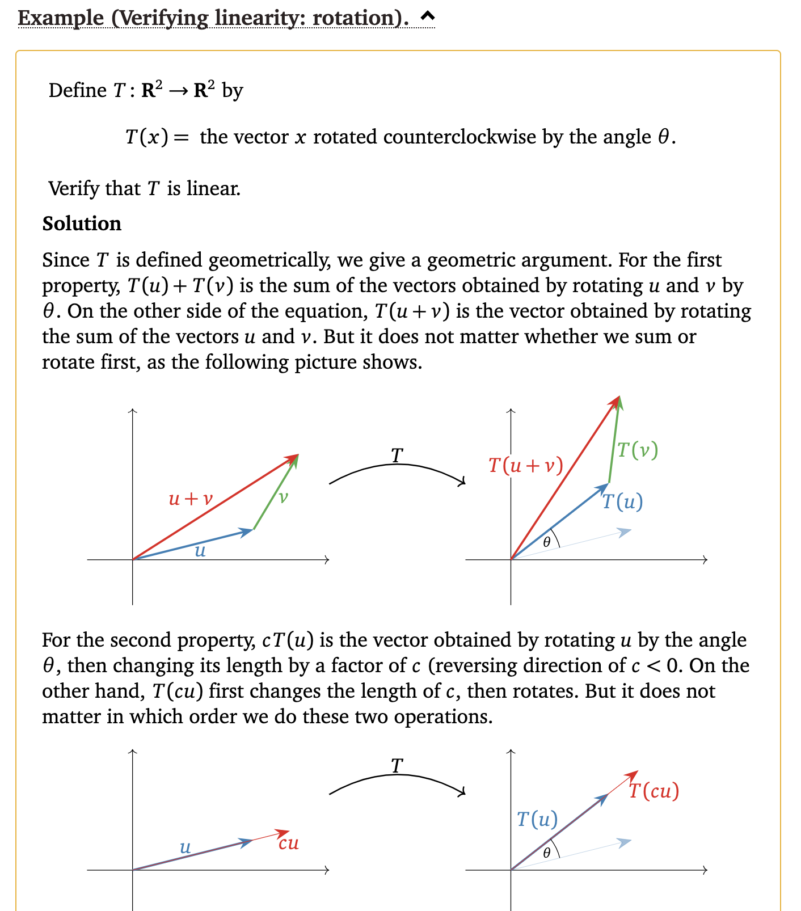
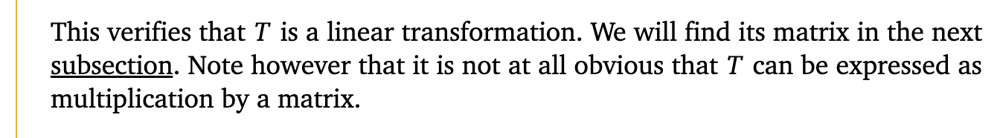
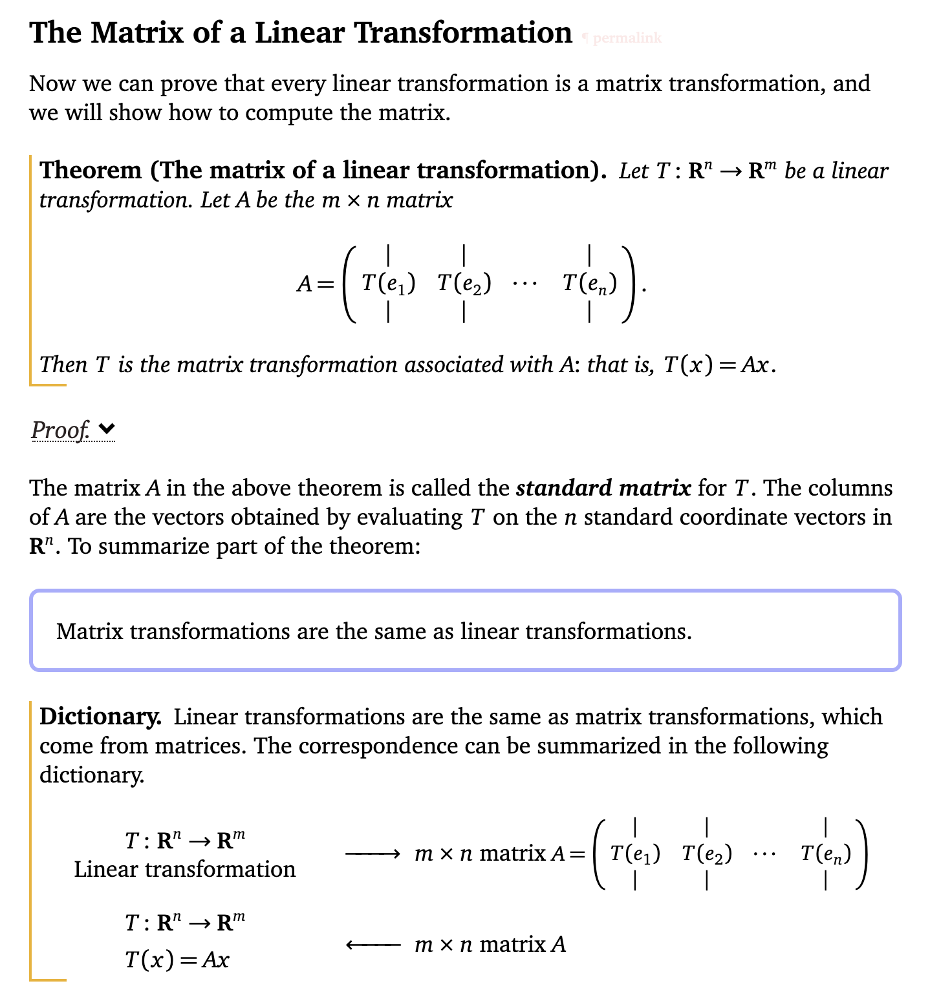

For understanding the concept of Linear Transformation in the context of PCA (Principal Component Analysis), we need to delve into some fundamental concepts of linear algebra and how they apply to data transformation.

