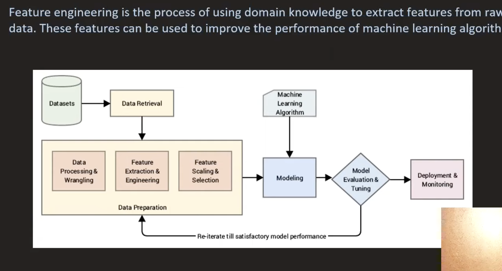
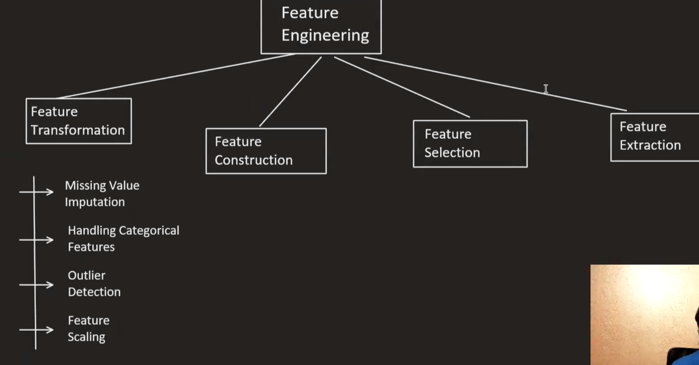

### Feature Engineering

Missing valaue imputation
- Mean/Median/Mode imputation
- Predictive imputation
- KNN imputation
- Interpolation
- Using a constant value
- Using a value from a related record
- Dropping missing values
- Using algorithms that support missing values
- Creating a missing value indicator
- Domain-specific methods

Encoding categorical variables
- One-hot encoding
- Label encoding
- Ordinal encoding
- Binary encoding
- Frequency encoding
- Target encoding
- Hashing encoding
- Embedding

Outlier treatment
 example: 
- Capping/Flooring
- Transformation
- Imputation
