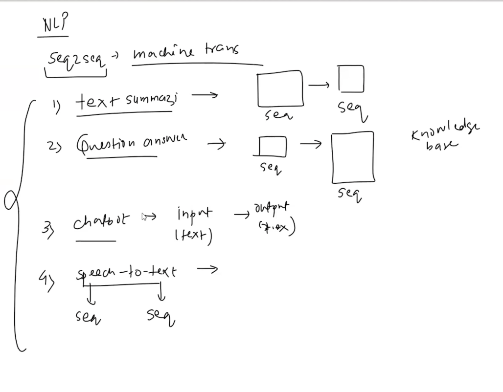

#sequence to sequence  models 

sequence to sequence models are a type of neural network architecture designed to handle tasks where both the input and output are sequences. These models are particularly useful in natural language processing (NLP) tasks such as machine translation, text summarization, and speech recognition. The key idea behind sequence to sequence models is to use an encoder-decoder architecture, where the encoder processes the input sequence and encodes it into a fixed-length context vector, which is then used by the decoder to generate the output sequence.

## A. Many-to-One Architecture
* **Characteristics:** Receives a full sequential sequence of inputs ($T_x > 1$) and maps them to a single static vector or scalar output ($T_y = 1$).
* **Data Layout:** * **Input:** Sequence of data points over multiple time steps.
    * **Output:** A single scalar or categorical classification vector (e.g., `1` or `0`).
* **Primary Application:** **Sentiment Analysis**
    * *Example:* Inputting a text review sentence ("This movie is incredible") and predicting whether it has a positive (`1`) or negative (`0`) sentiment flag at the final timestamp.

### B. One-to-Many Architecture
* **Characteristics:** Takes a single, non-sequential static input ($T_x = 1$) and generates a variable-length sequential output stream ($T_y > 1$).
* **Data Layout:**
    * **Input:** A static vector/scalar representation (e.g., raw image pixel tensor).
    * **Output:** A sequence of sequential data points (e.g., descriptive textual tokens).
* **Primary Application:** **Image Captioning / Image Description**
    * *Example:* Inputting a static image file into a model (often via a CNN feature extractor) to yield an output text sequence descriptive of the scene via a Google Image Search asset pipeline.

### C. Many-to-Many (Asynchronous) Architecture
* **Characteristics:** Maps a sequential input stream ($T_x$ steps) to a sequential output stream ($T_y$ steps) where the number of input time steps does not match or align directly in time with the output steps ($T_x \\neq T_y$). The model reads the entire input before starting to emit outputs.
* **Temporal Breakdown from Note Example:**
    * **Input processing window:** 3 to 4 sequential timesteps.
    * **Output generation window:** 5 distinct sequential timesteps.
* **Primary Application:** **Machine Translation / Google Translate**
    * *Example:* Translating English to Hindi. 
        * Input English text: `"I love India"` (3 structural word tokens).
        * Output Hindi text: `"मैं भारत से प्यार करता हूँ"` (6 structural word tokens).
    * Because sentence structures and syntax differ across human languages, an asynchronous sequence-to-sequence encoder-decoder model framework is vital.

### D. Many-to-Many (Synchronous) Architecture
* **Characteristics:** Processes sequential inputs and generates sequential outputs simultaneously in real-time step alignment ($T_x = T_y$). Each individual input timestamp has a directly corresponding output timestamp.
* **Data Layout:** Both inputs and outputs step through identical sequential increments (`1 -> 2 -> 3`).
* **Primary Applications:**
    * **POS Tagging (Part-of-Speech Tagging):** Labeling every sequential word token in a running sentence as a noun, verb, adjective, etc.
    * **NER (Named Entity Recognition):** Parsing a stream of text to detect and label real-world entities (e.g., names of people, organizations, locations) at the exact timestamp they appear.

---

## 3. Reference Frameworks Matrix

| Architecture Type | Input Size ($T_x$) | Output Size ($T_y$) | Temporal Style | Real-World Application Case |
| :--- | :--- | :--- | :--- | :--- |
| **Many-to-One** | Sequence ($T_x > 1$) | Scalar / Static ($T_y = 1$) | N/A | Sentiment Analysis (Text $\\rightarrow$ Binary Label) |
| **One-to-Many** | Scalar / Static ($T_x = 1$) | Sequence ($T_y > 1$) | N/A | Image Captioning (Image $\\rightarrow$ Description) |
| **Many-to-Many (Asynch)** | Sequence ($T_x$) | Sequence ($T_y$) | $T_x \\neq T_y$ | Machine Translation (Google Translate) |
| **Many-to-Many (Synch)** | Sequence ($T_x$) | Sequence ($T_y$) | $T_x = T_y$ | Text Extraction (POS Tagging, NER) |
"""

# Write content out to a standard markdown file (.md)
output_filename = "RNN_Sequence_Tasks_Notes.md"
with open(output_filename, "w", encoding="utf-8") as file:
    file.write(md_content)

print(f"File written successfully: {output_filename}")

Examplec
